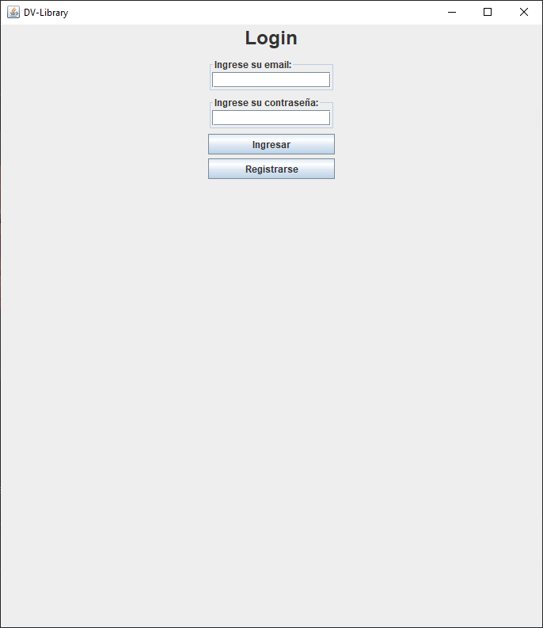
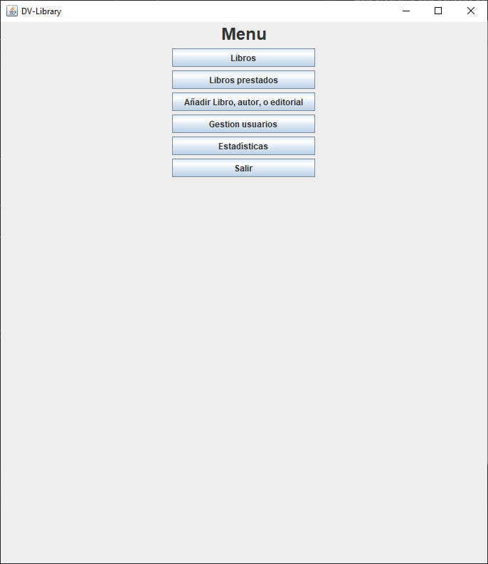
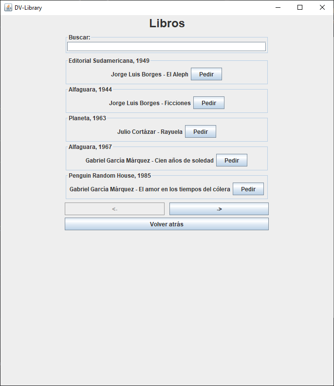
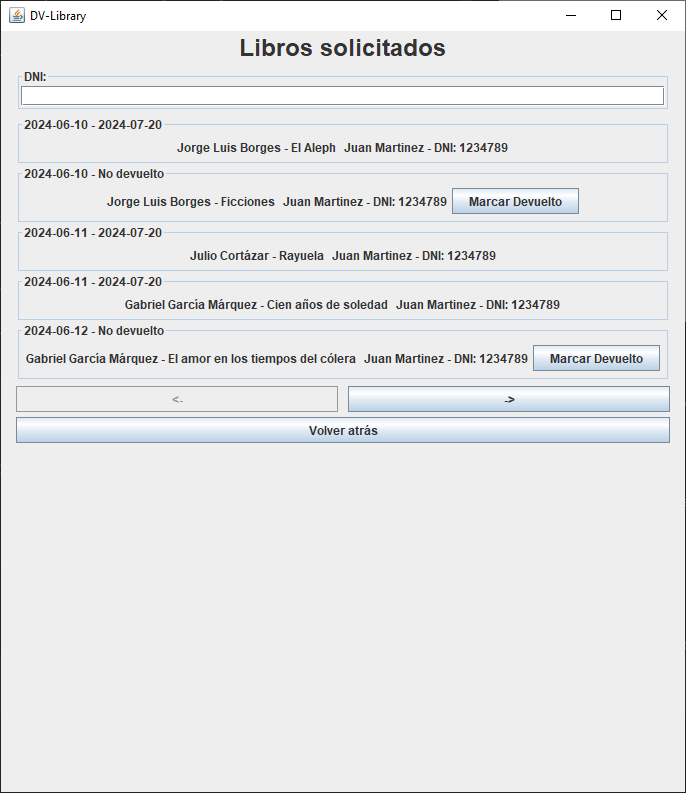
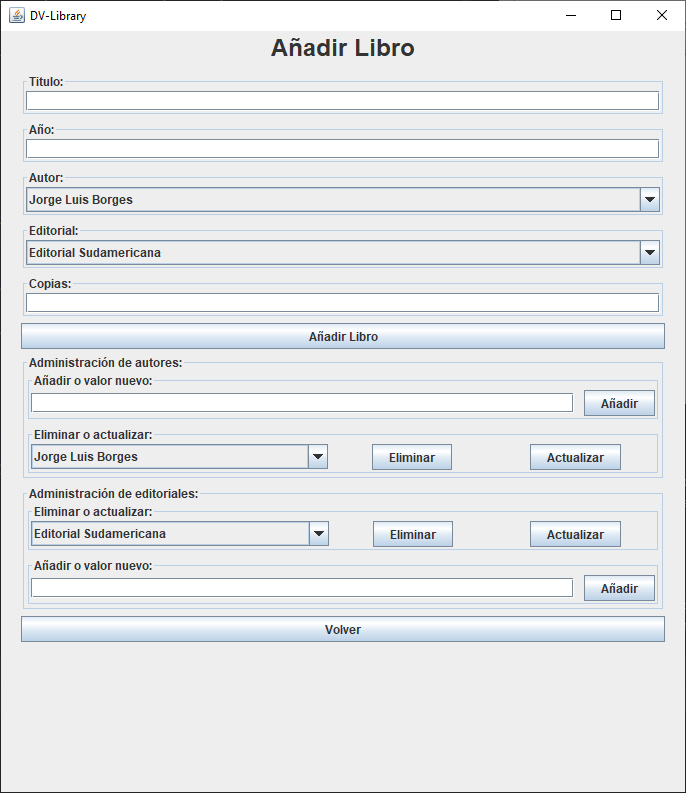

# Library-DV

Library DV es un programa acádemico que tiene de objetivo gestionar una librería
ficticia llamada DV.  
Este programa esta pensado para que lo acceda un usario final o un empleado desde
la libería misma, para manejar los libros que se prestan.

## Características
Este programa admite la gestion de usuarios y libros.

### Usuarios
Los usuarios pueden registrarse, logearse, ver los libros que han pedido en el tiempo,
y pedir prestado libros. Un usuario puede buscar un libro por el título.

### Empleados
Los empleados son usuarios que pueden manejar ciertos aspectos de la aplicación, como
agrear nuevos libros, marcar los libros prestados como devueltos y borrar otros 
usuarios. Un empleado puede buscar por dni de usuario los registros de los 
libros prestados.  
Los empleados también pueden ver estadísticas relevantes a la librería.

### Libros
Los libros pueden ser creados por los empleados y ser pedidos por los usuarios (que no
sean empleados). Cada libro posee un título, autor, editorial y fecha de estreno,
ademas, internamente se maneja las copias disponibles y copias totales.

## UML
El diagrama se encuentra en `/consigna, uml` en formatos `.png` y `.svg`, se incluye
el svg ya que el diagrama es muy grande y se ve mejor en ese formato.
Es un diagrama de clases hecho con mermaid, se incluye el `.mmd`